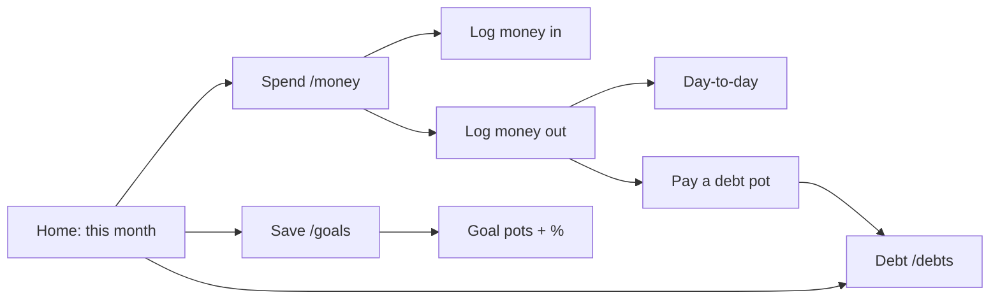

# Lifinance

**Clear the debt. Keep the life.** · **ปิดหนี้ให้ไว แต่ยังใช้ชีวิตได้**

A personal finance PWA that plans a realistic route out of debt — built from what
you actually earn and spend, not from a spreadsheet fantasy. Designed for people
with little financial background: three clear worlds (**Spend · Save · Debt**),
plain language (TH/EN), and numbers that move when you log money.

```bash
npm install
npm run dev          # http://localhost:3000
```

Open **Settings → Load demo data** for a populated Bangkok example (฿58k
take-home, three debts, goals, and ~60 days of spending).

Deploy as a static/SSR Next.js app (e.g. Vercel). All user data stays on-device in
`localStorage` until you add a backend.

---

## Product at a glance

| Tab | Route | Job |
| --- | --- | --- |
| **Home** | `/` | This month: left to spend · savings balance · debt to pay |
| **Spend** | `/money` | Money in, money out, envelopes, left-to-spend |
| **Save** | `/goals` | Total already saved + goals with % progress |
| **Debt** | `/debts` | Pay order #1/#2…, % paid, daily interest, close pots |
| **Settings** | `/settings` | Language, theme, income, export/import, install PWA |

Also: **`/assessment`** — lifestyle quiz that seeds a spending baseline (every
amount is editable, including `0`).

Legacy `/expenses` redirects to `/money`.

---

## Three money worlds



### Spend (`/money`)

- **Money in** — salary / other, logged by date.
- **Money out** — day-to-day spend *or* **pay debt** (pick which pot).
- **Left to spend** — from income after selected envelopes, or optionally  
  **spend pot − money out** only (“หักรายจ่ายจากกองใช้เท่านั้น”).
- **Envelopes you can toggle**
  - **Spend pot** — amount of income set aside for day-to-day (editable; suggested = income − save plan − debt plan).
  - **Save pot** — sum of goals’ *monthly* contributions (planning reserve).
  - **Debt pot** — mins + extra for this month (shrinks as you log debt payments).
- Money fields support simple math: `120+80`, live result on the keypad.

Debt payments create an expense linked to a `debtId`, reduce that debt’s balance,
raise its %, and **do not** double-count against day-to-day left-to-spend.

### Save (`/goals`)

- Hero number = **money already in goals** (`saved` total), not a system guess.
- Each goal: progress bar, milestones, quick `+` amounts, monthly contribution.
- Emergency-fund flag is respected by the budget engine.

### Debt (`/debts`)

- Ordered pay list (#1 focus gets the extra).
- Per pot: balance, **% paid** (like Save), min + extra this month, **daily interest**.
- **Pay this** → opens Spend with that pot pre-selected.
- When balance hits zero → **closed** section (success state).
- Strategy: Avalanche / Snowball / Auto (tucked under “why this order”).

### Home

One card: three envelopes for the month + shortcuts to log in/out and open Save/Debt.
Freedom card shows projected debt-free date when debts exist.

---

## Assessment (`/assessment`)

Lifestyle check-up that builds `baseline.monthlyByCategory`.

- Every money field is editable mid-quiz and on the review screen.
- **Required fields must be filled** — typing **`0` is allowed** (empty is not).
- Housing cost, bills, subscriptions (custom amounts), transport/food intensities, etc.
- Includes **family support** as an essential category.
- Applying the quiz sets monthly income + baseline used by the budget engine
  (blended with real expenses as data accumulates).

---

## Debt math

### Payoff simulation (`src/lib/debt-engine.ts`)

`simulatePayoff(debts, extraPerMonth, strategy)` steps month by month:

1. Monthly interest on each balance (`balance × apr / 12`).
2. Every debt gets its minimum (capped at payoff).
3. All remaining cash (extra + freed minimums) hits one focus debt, then cascades.

| Strategy | Target |
| --- | --- |
| **Avalanche** | Highest APR first (lowest total interest) |
| **Snowball** | Smallest balance first (fastest first win) |
| **Auto** | Simulates both; prefers earlier freedom, then lower cost |

Infeasible plans surface `feasible: false` + `shortfall` instead of looping forever.

### Daily interest on live balances (`src/lib/debt-interest.ts`)

Tracked debts accrue **simple daily interest** while open:

```
daily = balance × (APR / 100) / 365
```

Accrual is idempotent per calendar day (`lastInterestDate`). Payments via Spend
update `paidTotal`, reduce `balance`, and archive the debt when cleared.

Progress:

```
% paid ≈ paidTotal / (paidTotal + balance)
```

---

## Budget & month plan

**Budget engine** (`budget-engine.ts` + `recommend.ts`) answers *what can this
person sustain*:

```
available extra = income
                − essentials
                − lifestyle × keepRatio
                − goal monthly contributions
                − safety buffer (% of income)
                − minimum payments
```

**Month plan** (`month-plan.ts`) is the single story for Home / Spend / Save / Debt:

| Field | Meaning |
| --- | --- |
| `moneyIn` | Logged income this month, else settings `monthlyIncome` |
| `moneyOut` | Day-to-day expenses (excludes debt payments) |
| `savedTotal` | Sum of goal `saved` |
| `saveThisMonth` | Sum of goal `monthlyContribution` (envelope) |
| `payDebtsThisMonth` | Mins + extra |
| `debtPaidThisMonth` | Logged debt payments |
| `spendSuggested` | Income − save plan − debt plan |
| `leftToSpend` | Envelope formula or spend-pot-only mode |

---

## Install as a phone app (PWA)

No store required. Install from the browser:

- **Android / Chrome** — Install banner on Home, or menu → *Install app*.
- **iPhone / iPad (Safari)** — Share → *Add to Home Screen*.
- **Settings → Install as an app** always available.

| | Browser tab | Installed |
| --- | --- | --- |
| Chrome/Safari chrome | visible | gone — full screen |
| Launch | URL | home-screen icon |
| Offline | needs network | opens via service worker |
| Long-press icon | — | shortcuts (e.g. log spend / debts) |

Service worker: [`public/sw.js`](public/sw.js)

- Navigations **network-first** (fresh deploys win).
- `/_next/static/*` **cache-first** (fingerprinted).
- `/` precached; unknown offline routes get a bilingual offline page.
- Load-bearing details: `ignoreVary: true`, sync `response.clone()`, never
  `respondWith(undefined)`.

Icons from [`scripts/generate-icons.mjs`](scripts/generate-icons.mjs)
(`npm run icons`) — `any` + `maskable` variants committed to the repo.

> SW registers in **production only**. To test offline:  
> `npm run build && npm start`.

---

## Tech stack

| Layer | Choice |
| --- | --- |
| Framework | **Next.js 15** App Router, React 19 |
| Language | **TypeScript** (strict) |
| Styling | **Tailwind CSS v4** + CSS variables (dark / light) |
| UI | Hand-rolled, shadcn-compatible (`cn`, variants) |
| Icons | lucide-react |
| State | React Context + **`localStorage`** (offline-first) |
| Server schema | Prisma + Postgres models included (optional future sync) |
| Tests | `node --test` (no Jest/Vitest dependency) |

**Not used on purpose:** chart libraries, `next-intl`, Redux/Zustand.

### Commands

```bash
npm install
npm run dev          # http://localhost:3000
npm run build        # production build
npm run start        # serve production build
npm run typecheck    # tsc --noEmit
npm run test:engine  # debt + budget + month-plan + interest tests
npm run icons        # regenerate PWA icons from SVG
```

---

## Architecture

```
src/
├─ app/
│  ├─ page.tsx              Home
│  ├─ money/                Spend world
│  ├─ goals/                Save world
│  ├─ debts/                Debt world
│  ├─ assessment/           Lifestyle quiz
│  ├─ settings/
│  └─ expenses/             → redirects to /money
├─ lib/
│  ├─ debt-engine.ts        Monthly avalanche / snowball / auto
│  ├─ debt-interest.ts      Daily interest + pay / clear / reverse
│  ├─ budget-engine.ts      Spend profile + capacity
│  ├─ recommend.ts          Assessment-style budget split
│  ├─ month-plan.ts         Unified this-month numbers
│  ├─ assessment.ts         Quiz answers → monthly estimate
│  ├─ money-expr.ts         Safe money expressions (120+80)
│  ├─ types.ts              Shared shapes (≈ Prisma)
│  ├─ date.ts               Local calendar days (never UTC)
│  ├─ format.ts             Locale + currency
│  └─ seed.ts               Categories, defaults, demo data
├─ i18n/
│  ├─ dictionaries.ts       Full TH/EN (typed key-complete)
│  └─ I18nProvider.tsx
├─ store/FinanceProvider.tsx  Single store; all derived values memoised
└─ components/
   ├─ ui/                   Card, Button, Field, Sheet, Toast, Progress…
   ├─ dashboard/            Home cards
   ├─ debts/ expenses/ money/
   └─ AppShell.tsx          Sidebar ≥lg · top + bottom tabs <lg

public/sw.js                Service worker
prisma/schema.prisma        Optional server schema
```

Derived values (profile, budget, recommendation, payoff plan, month plan) are
computed once in `FinanceProvider` on data change — not per render.

---

## Data (client)

Persisted key: `lifinance.state.v1` in `localStorage`.

| Entity | Highlights |
| --- | --- |
| **Settings** | language, theme, currency, income, payday, strategy, keep ratio, buffer %, spend window, spend pot, envelope toggles, `spendAgainstPotOnly` |
| **IncomeEntry[]** | amount, date, kind (`salary` \| `other`) |
| **Expense[]** | amount, date, categoryId, note, recurrence; optional **`debtId`** for debt payments |
| **Debt[]** | balance, principal, apr, minPayment, dueDay, `paidTotal`, `interestAccrued`, `lastInterestDate`, `archivedAt` |
| **Goal[]** | target, saved, monthlyContribution, isEmergencyFund |
| **Category[]** | key, group, emoji, isEssential, quickAmounts |
| **Baseline?** | from assessment |

**Export / Import JSON** in Settings is the backup story (no cloud sync yet).

### Default categories (essentials marked ✓)

| Group | Categories |
| --- | --- |
| Essential | Rent ✓, Utilities ✓, Groceries ✓, Phone ✓, Insurance ✓, Family support ✓, **Debt payment** ✓ |
| Tech | AI tools, Cloud, Streaming, Software |
| Food | Coffee, Matcha, Eating out, Delivery, Snacks |
| Pet | Cat food ✓, Pet supplies, Vet ✓ |
| Hobby | Badminton, Gym, DIY, Gear |
| Transport | Fuel ✓, Transit ✓, Ride-hailing |
| Health & other | Health ✓, Beauty, Gifts, Misc |

Money on the client is `number` (fine for offline UX). For a real multi-user API,
prefer integer minor units + `Decimal` as noted in the Prisma schema.

---

## Language (TH / EN)

- Toggle in the header on every screen + Settings.
- `en` is source of truth; `th` is typed as a deep map of `en` — **missing Thai
  keys fail `tsc`**.
- Dates/money via `Intl`; Thai calendar pinned to Gregorian
  (`th-TH-u-ca-gregory`).
- Whole-phrase templates (`"{amount}"`) so Thai word order stays correct.

---

## Design system

| Token | Dark | Light |
| --- | --- | --- |
| `--neon` | `#39FF14` | `#16A34A` |
| `--bg` | `#070A07` | `#F6F7F5` |
| `--surface` | `#101510` | `#FFFFFF` |

- Neon as spotlight (one hero number per card).
- Tabular nums on money.
- Progress animates (~700ms); respects `prefers-reduced-motion`.
- Plain copy: “Debt-free on”, not “amortisation term”.

| Breakpoint | Nav |
| --- | --- |
| &lt; `lg` | Top bar + bottom tabs (safe-area aware) |
| ≥ `lg` | Left sidebar |

---

## What is deliberately not here

- No accounts, no analytics, no bank sync — data stays on the device.
- No investment product recommendations (stated in Settings → About).
- No forced cloud database (Prisma schema is ready when you need multi-device).

---

## Roadmap (if you take it further)

1. Wire Prisma / Postgres (or Supabase) + auth; migrate money to integer minor units.
2. Sync / restore across devices; keep export/import as backup.
3. Push reminders on `dueDay`.
4. Projection vs reality for debt payments (schema already sketches `Payment`).
5. Optional Play Store listing via TWA / PWABuilder (app is already a PWA).

---

## License / status

Personal / prototype-friendly codebase. Review privacy copy before a public
launch — today all financial data remains in the user’s browser storage.
